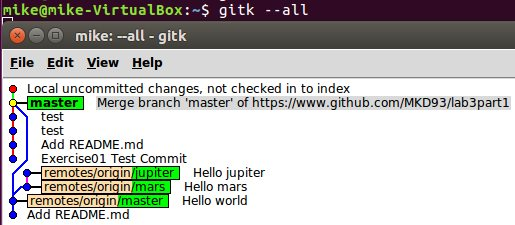

##Part 1
https://github.com/MKD93/lab3part1

###4.
####Output from command "gitk"

####Output from command "gitk --all"

####Output from command "git log --graph --oneline --decorate"

##Part 2
###4.
####Learn Git Branching Level 1:

####Learn Git Branching Level 2:

####Learn Git Branching Level 3:

####Learn Git Branching Level 4:

####Learn Git Branching Status:

##Part 3
###4. https://github.com/MKD93/courseproject

###5. https://github.com/MKD93/Story-Fall2016
