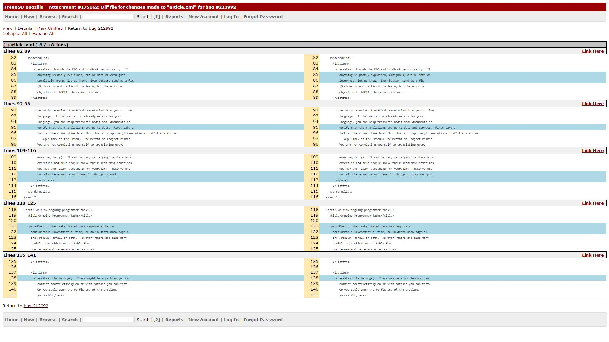

### SVN Commit: https://bugs.freebsd.org/bugzilla/show_bug.cgi?id=212992
### Diff File:  https://bugs.freebsd.org/bugzilla/attachment.cgi?id=175162&action=diff

### Commit image:

### Diff image:

####It is important to maintain good documentation so that code may be more easily maintained and understood by developers and third parties. Good documentation also provides information regarding the purpose and functionality of code so that further use and developments made involving documented code do not deviate from expectations, standards, and norms. 

#### This laboratory exercise provided insights, as well as a successful real-world example, on how good documentation is important.
