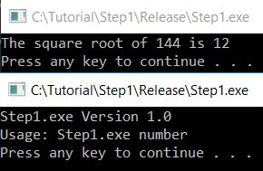
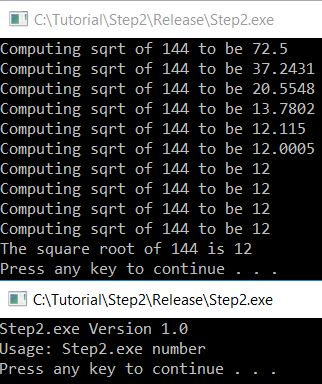
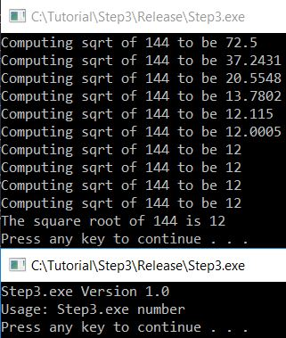
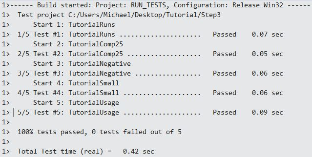
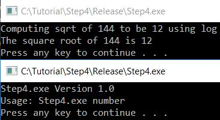
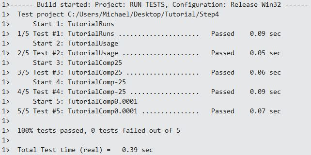
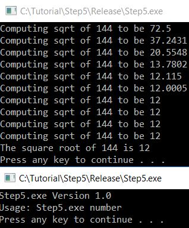
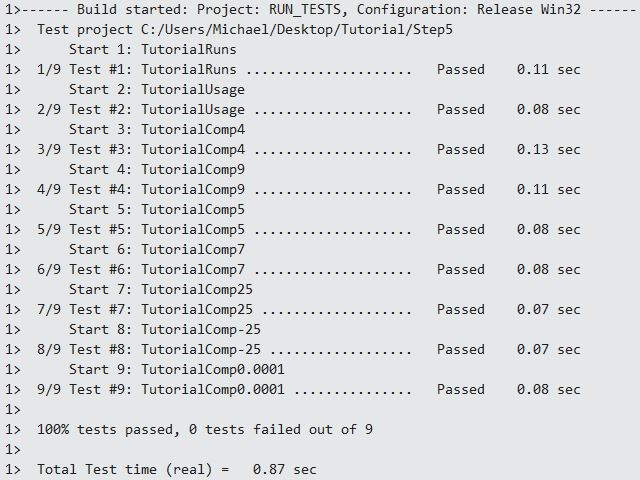

##Step 1


##Step 2


##Step 3



##Step 4



##Step 5



##Final File Contents
**CMakeLists.txt**
```
cmake_minimum_required (VERSION 2.6)
project (Tutorial)

# The version number.
set (Tutorial_VERSION_MAJOR 1)
set (Tutorial_VERSION_MINOR 0)

# does this system provide the log and exp functions?
include (${CMAKE_ROOT}/Modules/CheckFunctionExists.cmake)
check_function_exists (log HAVE_LOG)
check_function_exists (exp HAVE_EXP)

# should we use our own math functions
option(USE_MYMATH "Use tutorial provided math implementation" ON)

# configure a header file to pass some of the CMake settings
# to the source code
configure_file (
  "${PROJECT_SOURCE_DIR}/TutorialConfig.h.in"
  "${PROJECT_BINARY_DIR}/TutorialConfig.h"
  )

# add the binary tree to the search path for include files
# so that we will find TutorialConfig.h
include_directories ("${PROJECT_BINARY_DIR}")

# add the MathFunctions library?
if (USE_MYMATH)
  include_directories ("${PROJECT_SOURCE_DIR}/MathFunctions")
  add_subdirectory (MathFunctions)
  set (EXTRA_LIBS ${EXTRA_LIBS} MathFunctions)
endif ()

# add the executable
add_executable (Tutorial tutorial.cxx)
target_link_libraries (Tutorial  ${EXTRA_LIBS})

# add the install targets
install (TARGETS Tutorial DESTINATION bin)
install (FILES "${PROJECT_BINARY_DIR}/TutorialConfig.h"
  DESTINATION include)

# enable testing
enable_testing ()

# does the application run
add_test (TutorialRuns Tutorial 25)

# does the usage message work?
add_test (TutorialUsage Tutorial)
set_tests_properties (TutorialUsage
  PROPERTIES
  PASS_REGULAR_EXPRESSION "Usage:.*number"
  )

#define a macro to simplify adding tests
macro (do_test arg result)
  add_test (TutorialComp${arg} Tutorial ${arg})
  set_tests_properties (TutorialComp${arg}
    PROPERTIES PASS_REGULAR_EXPRESSION ${result}
    )
endmacro ()

# do a bunch of result based tests
do_test (4 "4 is 2")
do_test (9 "9 is 3")
do_test (5 "5 is 2.236")
do_test (7 "7 is 2.645")
do_test (25 "25 is 5")
do_test (-25 "-25 is 0")
do_test (0.0001 "0.0001 is 0.01")
```

**tutorial.cxx**
```
// A simple program that computes the square root of a number
#include "TutorialConfig.h"
#include <math.h>
#include <stdio.h>
#include <stdlib.h>
#include <windows.h.>

#ifdef USE_MYMATH
#include "MathFunctions.h"
#endif

int main(int argc, char* argv[])
{
  if (argc < 2) {
    fprintf(stdout, "%s Version %d.%d\n", argv[0], Tutorial_VERSION_MAJOR,
            Tutorial_VERSION_MINOR);
    fprintf(stdout, "Usage: %s number\n", argv[0]);
	system("pause");
    return 1;
  }

  double inputValue = atof(argv[1]);
  double outputValue = 0;

  if (inputValue >= 0) {
#ifdef USE_MYMATH
    outputValue = mysqrt(inputValue);
#else
    outputValue = sqrt(inputValue);
#endif
  }

  fprintf(stdout, "The square root of %g is %g\n", inputValue, outputValue);
  system("pause");
  return 0;
}
```

**TutorialConfig.h.in**
```
// the configured options and settings for Tutorial
#define Tutorial_VERSION_MAJOR @Tutorial_VERSION_MAJOR@
#define Tutorial_VERSION_MINOR @Tutorial_VERSION_MINOR@
#cmakedefine USE_MYMATH

// does the platform provide exp and log functions?
#cmakedefine HAVE_LOG
#cmakedefine HAVE_EXP
```

**TutorialConfig.h**
```
// the configured options and settings for Tutorial
#define Tutorial_VERSION_MAJOR 1
#define Tutorial_VERSION_MINOR 0
#define USE_MYMATH

// does the platform provide exp and log functions?
#define HAVE_LOG
#define HAVE_EXP
```

**MathFunctions/CMakeLists.txt**
```
# first we add the executable that generates the table
# add the binary tree directory to the search path for include files
include_directories( ${CMAKE_CURRENT_BINARY_DIR} )

add_executable(MakeTable MakeTable.cxx )
# add the command to generate the source code
add_custom_command (
  OUTPUT ${CMAKE_CURRENT_BINARY_DIR}/Table.h
  COMMAND MakeTable ${CMAKE_CURRENT_BINARY_DIR}/Table.h
  DEPENDS MakeTable
  )

# add the main library
add_library(MathFunctions mysqrt.cxx ${CMAKE_CURRENT_BINARY_DIR}/Table.h  )

install (TARGETS MathFunctions DESTINATION bin)
install (FILES MathFunctions.h DESTINATION include)
```

**MathFunctions/MakeTable.cxx**
```
// A simple program that builds a sqrt table
#include <math.h>
#include <stdio.h>

int main(int argc, char* argv[])
{
  int i;
  double result;

  // make sure we have enough arguments
  if (argc < 2) {
    return 1;
  }

  // open the output file
  FILE* fout = fopen(argv[1], "w");
  if (!fout) {
    return 1;
  }

  // create a source file with a table of square roots
  fprintf(fout, "double sqrtTable[] = {\n");
  for (i = 0; i < 10; ++i) {
    result = sqrt(static_cast<double>(i));
    fprintf(fout, "%g,\n", result);
  }

  // close the table with a zero
  fprintf(fout, "0};\n");
  fclose(fout);
  return 0;
}
```

**MathFunctions/mysqrt.cxx**
```
#include "MathFunctions.h"
#include "TutorialConfig.h"
#include <stdio.h>

// include the generated table
#include "Table.h"

#include <math.h>

// a hack square root calculation using simple operations
double mysqrt(double x)
{
  if (x <= 0) {
    return 0;
  }

  double result;

  // if we have both log and exp then use them
  double delta;

  // use the table to help find an initial value
  result = x;
  if (x >= 1 && x < 10) {
    result = sqrtTable[static_cast<int>(x)];
  }

  // do ten iterations
  int i;
  for (i = 0; i < 10; ++i) {
    if (result <= 0) {
      result = 0.1;
    }
    delta = x - (result * result);
    result = result + 0.5 * delta / result;
    fprintf(stdout, "Computing sqrt of %g to be %g\n", x, result);
  }

  return result;
}
```

**MathFunctions/MathFunctions.h**
```
double mysqrt(double x);
```

**MathFunctions/Table.h**
```
double sqrtTable[] = {
0,
1,
1.41421,
1.73205,
2,
2.23607,
2.44949,
2.64575,
2.82843,
3,
0};
```
