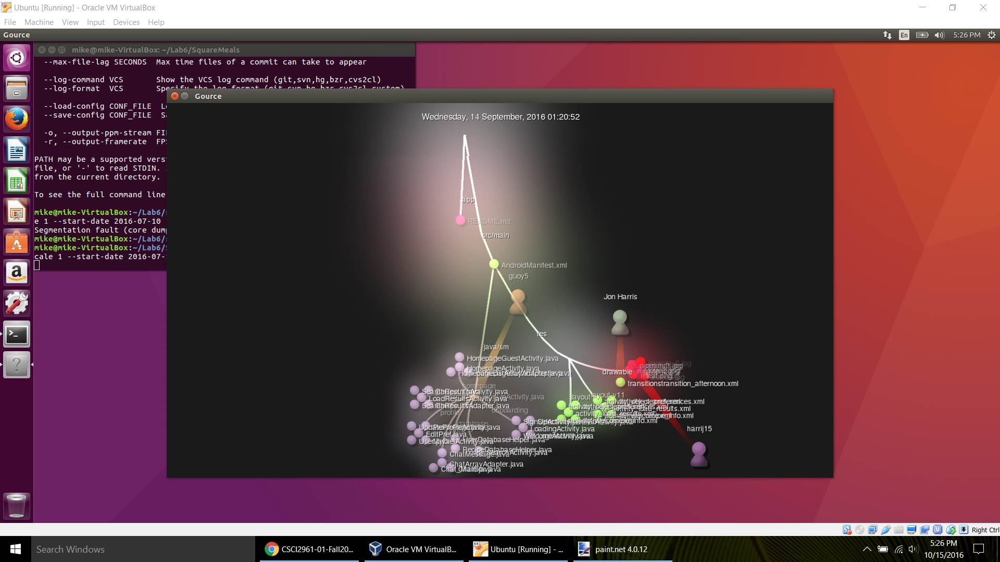
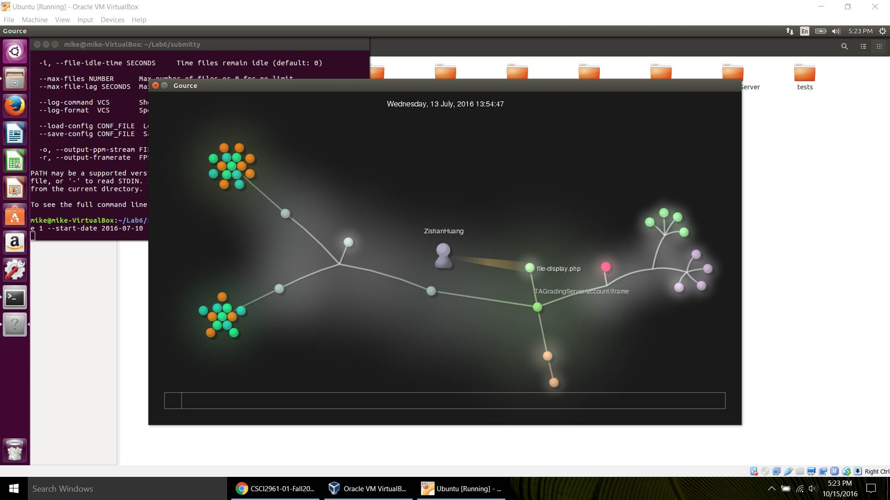
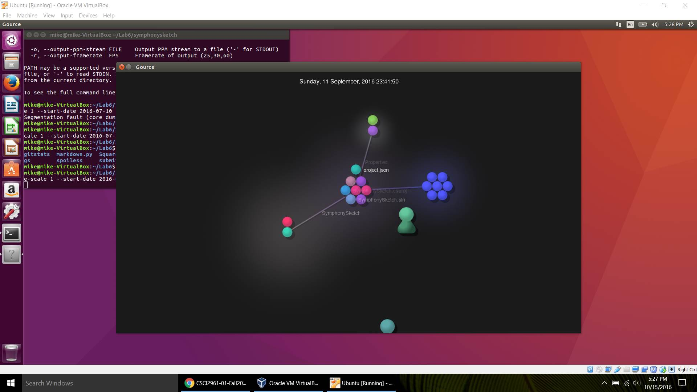
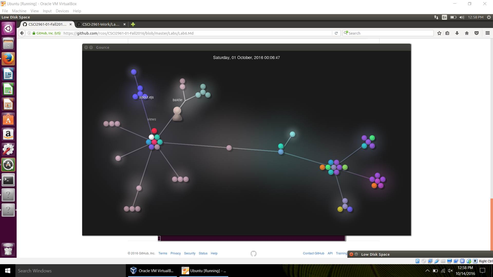

##Part 1

###Manual Data
Project | Contributors | Lines of Code | First Commit | Latest Commit | Branches
----------|:----------|:----------|:----------|:----------|:----------
Spoiless | 1 | 0 | N/A | N/A | 0
Square Meals | 7 | ~17742 | December 27, 2015 | September 29, 2016 | 6
Submitty | 25 | ~147834 | January 31, 2014 | October 12, 2016 | 10
Symphony Sketch | 2 | ~806 | September 11, 2016 | September 13, 2016 | 1
The Weird Side of Youtube | 6 | ~19031 | November 29, 2015 | October 13, 2016 | 4

###GitStats Data
Project | Contributors | Lines of Code | First Commit | Latest Commit | Branches
----------|:----------|:----------|:----------|:----------|:----------
Spoiless | 1 | 0 | N/A | N/A | 0
Square Meals | 10 | 8130 | December 27, 2015 | September 19, 2016 | 6
Submitty | 42 | 144759 | October 18, 2015 | October 12, 2016 | 10
Symphony Sketch | 4 | 750 | September 11, 2016 | September 13, 2016 | 1
The Weird Side of Youtube | 11 | 10672 | November 29, 2015 | October 13, 2016 | 4

###Contribution Visualizations

##Part 2
