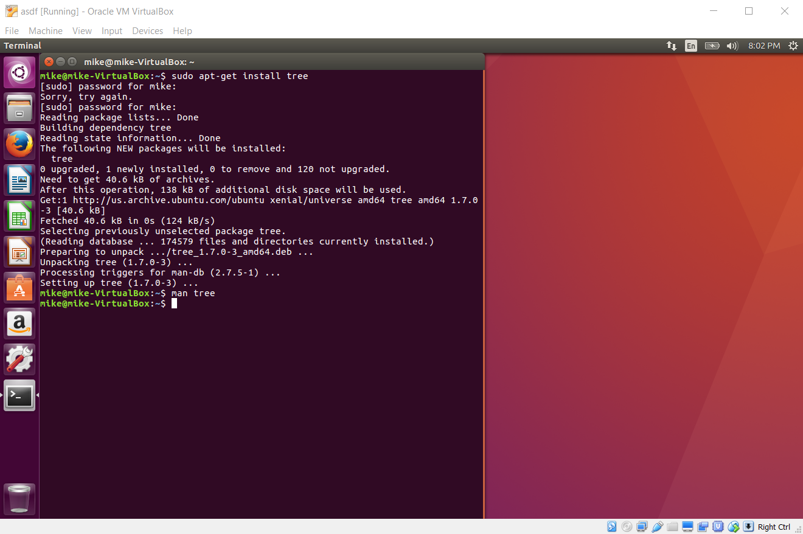
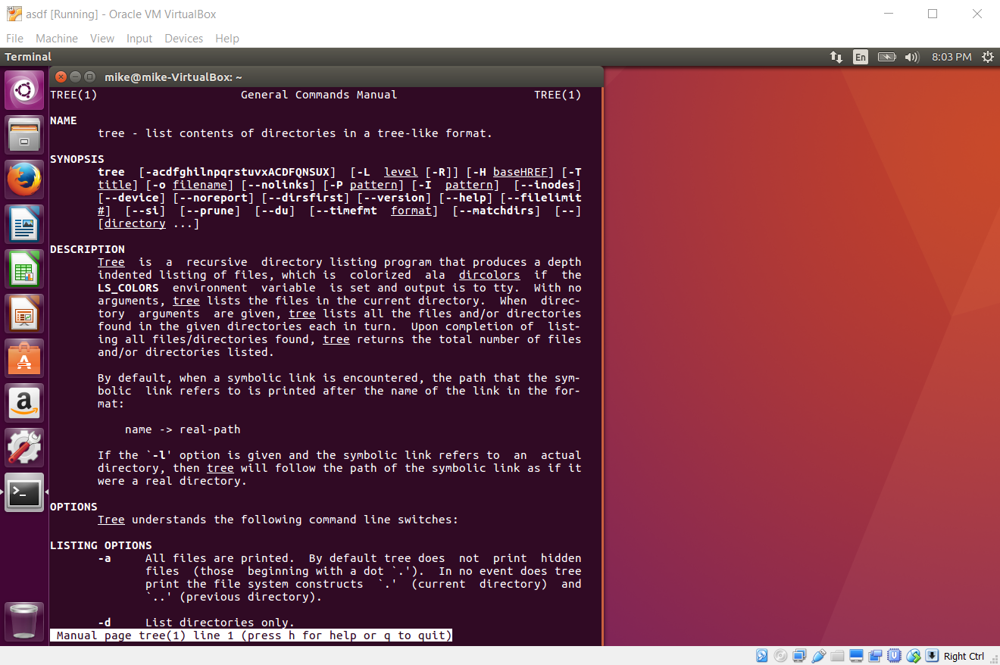
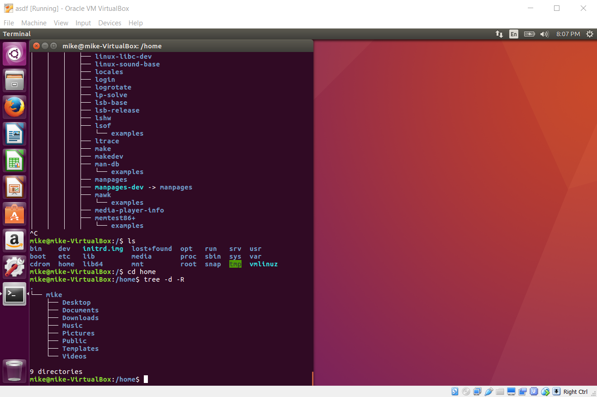
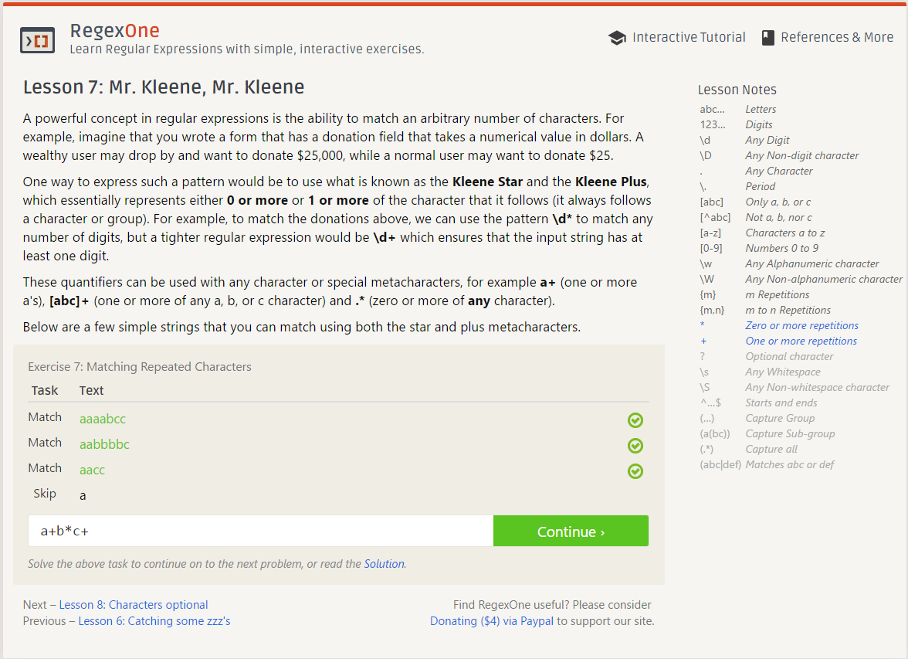
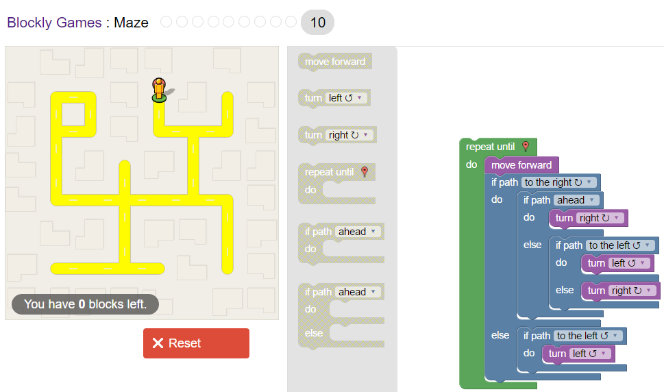

##CSCI-2961 Lab 1 Work
### c.

    2. In order to answer questions in a more helpful and useful way, it may be important to address one's answer to a question while
       utilizing different learning methods (e.g. visual learning, etc.).

       A second useful way to answer questions more effectively involves volume and clarity; it is important to be clear and concise in both questioning and answering.
       
    3. After reading chapter 3 of "Free Culture", I was disturbed and upset with what I read. I feel that the RIAA lawsuit against
       Jesse was unjust and unnecessary; especially since he was not directly at fault for the illegal distribution of audio files.
       It is sad that a creator and an innovator can easily become the target of an archaic and corrupt system that puts morals aside
       in exchange for profit.

### d. Unix Stuff

    3. Installation and usage of "tree" command

### e. Regular Expressions

    2. Regex Tutorial Step #7

    3. Regex Crossword Solutions
    

### f. Blockly Solution #10

g. Many different subject fields in computer science interest me; particularly problems involved within computer graphics, cryptography, compressios, and machine learning. I have not chosen any particular project as of yet to invest time and work into.

