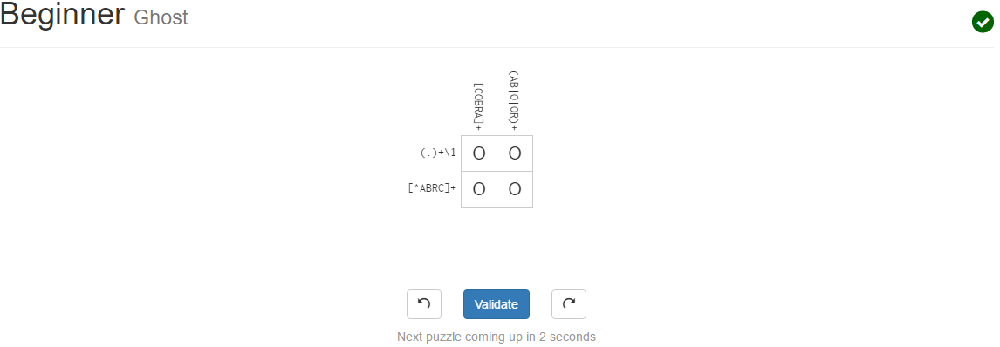

##CSCI-2961 Lab 1 Work
### c.

    2.

    3.

### d. Unix Stuff

    3. Installation and usage of "tree" command

### e. Regular Expressions

    2. Regex Tutorial Step #7

    3. Regex Crossword Solutions
    

### f. Blockly Solution #10

g.

